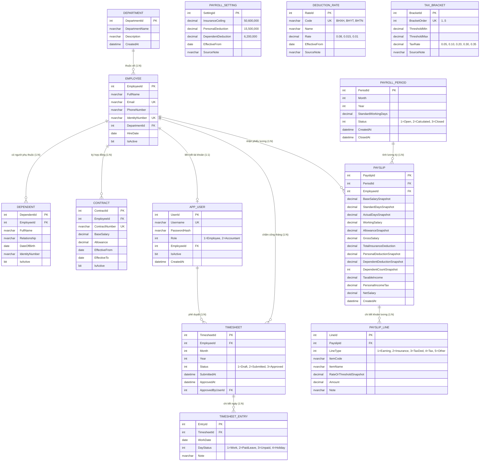

# Sơ Đồ Cơ Sở Dữ Liệu (ERD) - Chuẩn 3NF
**Hệ Thống Chấm Công & Tính Lương (SmartPayroll)**  
*Sinh viên thực hiện:* Nguyễn Viết Mẫn (MSSV: 23K4080026) - Trường ĐH Kinh tế, ĐH Huế  

---

## 1. Sơ Đồ Quan Hệ Thực Thể (Mermaid Diagram)

---

## 2. Các Ràng Buộc Khóa & Chỉ Mục Quan Trọng

1. `UQ_Employee_Month_Year`: Ràng buộc `UNIQUE (EmployeeId, Month, Year)` trên bảng `Timesheet` — mỗi nhân viên chỉ có duy nhất 1 bảng công trong 1 tháng.
2. `UQ_Timesheet_WorkDate`: Ràng buộc `UNIQUE (TimesheetId, WorkDate)` trên bảng `TimesheetEntry` — không thể chấm công 2 lần trong cùng một ngày cho 1 bảng công.
3. `UQ_Period_Month_Year`: Ràng buộc `UNIQUE (Month, Year)` trên bảng `PayrollPeriod` — không thể tạo trùng lặp kỳ lương.
4. `UQ_Period_Employee`: Ràng buộc `UNIQUE (PeriodId, EmployeeId)` trên bảng `Payslip` — trong 1 kỳ lương mỗi nhân viên chỉ có đúng 1 phiếu lương.
5. Cặp Header - Line:
   * `Payslip` $\leftrightarrow$ `PayslipLine` (bắt buộc lưu trong **1 DB Transaction ACID**).
   * `Timesheet` $\leftrightarrow$ `TimesheetEntry`.

